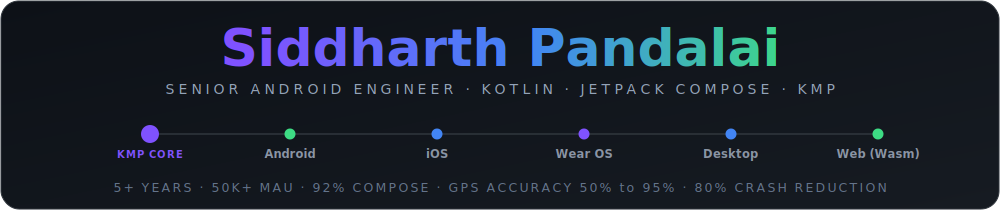

<div align="center">




**Senior Android Engineer** — 5+ years building Android at scale. SDE-2 & Android Platform Owner at [Dice.tech](https://dice.tech/), owning a platform serving **50,000+ MAU / 22,000+ DAU**. I ship deep, well-architected Kotlin — and I extract the reusable parts into a Multiplatform toolkit family so the next app starts further ahead.

🌐 **[darkpandawarrior.github.io](https://darkpandawarrior.github.io)** &nbsp;·&nbsp; 📄 **[Interactive CV](https://cv-siddharth.vercel.app)** &nbsp;·&nbsp; 💼 **[LinkedIn](https://linkedin.com/in/siddharth-pandalai-3712b215a)**

**[What I've shipped](#what-ive-shipped)** · **[KMP toolkit family](#the-kotlin-multiplatform-toolkit-family)** · **[Flagship apps](#flagship-open-source)** · **[Side projects](#side-projects--open-source)** · **[Tech stack](#tech-stack)** · **[Connect](#connect)**

</div>

---

> **At a glance** — **50k+ MAU / 22k DAU** platform owner · **80%** crash reduction · GPS accuracy **50% → 95%** · **92%** Jetpack Compose migration of a 738k-LOC codebase · a **36-module** MIT Kotlin Multiplatform toolkit + **17** shared Gradle conventions, running on Android · iOS · Wear OS · Desktop · Web.

```kotlin
val siddharth = AndroidEngineer(
    location = "Pune, India",
    yearsOfExperience = 5, // and counting
    role = "SDE-2 · Android Platform Owner @ Dice.tech",
    currentFocus = listOf("Compose Multiplatform", "Offline-first architecture", "Performance engineering", "System design"),
    believesIn = "extract the reusable core the moment a second app needs it",
)
```

## What I've shipped

- 📍 **Location engineering** — predictive dead reckoning + sensor fusion (accelerometer + GPS), taking tracking accuracy from **50% → 95%** in production, with spike detection and a deterministic recompute that re-derives history when the math changes.
- 🎨 **92% Jetpack Compose migration** of a **738k+ LOC** codebase, including a custom theme engine that cut UI-development friction by **60%**.
- 🛡️ **80% crash reduction** — dual Firebase Crashlytics + Sentry monitoring (programmatic init, ProGuard mapping, ANR detection), threading fixes and structured-concurrency cleanup.
- 🔐 **Security hardening** — SQLCipher + Android Keystore (AES-256), SSL pinning as dual build flavors, BiometricPrompt + CryptoObject, VAPT/banking-compliant.
- ✈️ **Trip V2 travel platform** — mileage submission linked to Itinerary V2, approval flows and full analytics across the mileage ecosystem.
- 🏢 **20+ white-label client apps** at Jugnoo / Jungleworks with an **80% reduction** in delivery time via build automation — and a **+85%** Play Store rating with reviews up **80×**.

## The Kotlin Multiplatform toolkit family

Most of my open source is one system: a family of decoupled repos where the **reusable libraries**, the **shared build logic**, and the **app shape** each live in their own place — so a new app pulls them in and starts at "write the feature."

<table>
<tr>
<td width="34%" valign="top">

### 🧰 [kmp-toolkit](https://github.com/darkpandawarrior/kmp-toolkit)
**36-module** MIT KMP library monorepo

</td>
<td valign="top">

A family of small, focused libraries — each extracted the moment a *second* consumer needed the same logic, never designed as a "platform" up front. Typed `Result`, an MVI ViewModel core, an offline-first `store` (decision engine + read/write streams), `network`, `security`, on-device AI (ML Kit GenAI / MediaPipe / Apple Foundation Models behind one seam), `device-integrity`, an operation-log `offline-outbox`, `feedback`, encrypted `settings`, and a **19-provider** payment-gateway abstraction. MIT.

</td>
</tr>
<tr>
<td valign="top">

### ⚙️ [kmp-build-logic](https://github.com/darkpandawarrior/kmp-build-logic)
**17** Gradle convention plugins

</td>
<td valign="top">

The AGP / Kotlin / Compose / test / lint / Firebase / Room / Koin setup written **once** and applied with one line — `shared.kmp.library`, `shared.kmp.compose`, `shared.android.firebase`, `shared.purity`, and more. Vendored via `includeBuild` across **5** repos, so version bumps aren't copy-pasted per project.

</td>
</tr>
<tr>
<td valign="top">

### 🌱 [kmp-app-template](https://github.com/darkpandawarrior/kmp-app-template)
A buildable CMP app seed

</td>
<td valign="top">

The app *shape* the toolkit slots into: one shared Compose UI, a wired root-navigation scaffold (Splash → Login → Home), and thin Android + Desktop shells — nothing to delete before you begin. `customizer.sh` renames the whole project in one command.

</td>
</tr>
</table>

## Flagship open source

### 🗺 Mileway — Offline-first Mileage & Trip Tracker

> **Kotlin Multiplatform** · Android + iOS + Wear OS + watchOS + Desktop · **31-module** clean architecture

- Five platforms from one codebase — native SwiftUI watchOS app, Glance + WidgetKit widgets, iOS Live Activity / Dynamic Island.
- **149 Roborazzi screenshot tests** on the JVM (no emulator, no network), detekt / ktlint / Kover, CI.
- Dual `gms` / `noGms` distribution with a dependency-prefix guard (Play Store + F-Droid).
- Sensor-fusion location engine with predictive dead reckoning; on-device document AI (OCR field-fill, doc-type classification) and an on-device LLM assistant behind a shared `LlmGateway`.

[](https://github.com/darkpandawarrior/Mileway#gh-dark-mode-only)
[](https://github.com/darkpandawarrior/Mileway#gh-light-mode-only)

---

### 🃏 Kursi — Bluffing Card Game

> **Compose Multiplatform** · Android + iOS + Desktop + Web (Wasm) · **13 modules** · ISMCTS + LLM AI opponents

Satirical India corporate-political underworld — *Kursi ke liye kuch bhi karega.*

- **Tiered AI** — ISMCTS bots (1.5k–16k iterations by difficulty) → cloud-LLM upgrade (Anthropic / OpenAI / Gemini / on-device); each of 10 personas has a personality profile driving targeting and bluff choices.
- **DARBAR social layer** — bots form alliances, carry grudges, send Hinglish chat — *without breaking the engine's byte-for-byte determinism.*
- A deterministic, dependency-free `:engine` (a `shared.purity` tripwire keeps it that way), consuming the kmp-toolkit family via a git submodule.

[](https://github.com/darkpandawarrior/Kursi#gh-dark-mode-only)
[](https://github.com/darkpandawarrior/Kursi#gh-light-mode-only)

---

### 💳 PaymentsLab — Payments Integration Lab

> **Kotlin Multiplatform** · Android + iOS · Ktor backend · **39-module** architecture

An Integration Lab for the Android payments ecosystem — every gateway behind one abstraction, with a live look at what actually happens on each transaction.

- **Gateway catalog** behind one `PaymentGateway` abstraction — Razorpay, Cashfree, Stripe (+ Google Pay), Square, Omise, UPI intent, plus hosted-webview and mobile-money archetypes; one Gradle module per native-SDK provider, contributed via Koin's `getAll<PaymentGateway>()`.
- **Server is the source of truth** — a companion Ktor server owns order creation, HMAC-SHA256 signature verification and webhook reconciliation; the client callback is only ever a hint.
- **Process-death recovery + VAPT-grade security** — every in-flight payment is journaled to Room before the SDK opens; Android Keystore AES-256-GCM at rest, device-integrity checks, certificate pinning.

[](https://github.com/darkpandawarrior/PaymentsLab#gh-dark-mode-only)
[](https://github.com/darkpandawarrior/PaymentsLab#gh-light-mode-only)

## Side projects & open source

| Project | What it is |
|---------|-----------|
| [**cv-siddharth**](https://github.com/darkpandawarrior/cv-siddharth) &nbsp;[](https://cv-siddharth.vercel.app) | Interactive CV with an AI assistant — React 19, multi-provider LLM chat, 3D hero, printable résumé |
| [**HireSignal**](https://github.com/darkpandawarrior/HireSignal) | Local-first AI career-intelligence dashboard — resume onboarding, reverse-ATS discovery, evidence-based fit scoring, tailored résumés, single-server multi-profile. Built on the open-source career-ops engine |
| [**kmp-app-template**](https://github.com/darkpandawarrior/kmp-app-template) | The buildable CMP app seed above — fork it, `customizer.sh --package …`, and start shipping |

**Open-source contributions** — **30+ merged PRs** on the [career-ops / HireSignal](https://github.com/kirklazar-android/hiresignal) engine, including its multi-profile scoring/onboarding fusion, a production-grade README refresh, and the dashboard tabs.

## Tech stack


**Architecture:** MVVM + Clean Architecture · MVI unidirectional state · Repository pattern · Multi-module · Gradle convention plugins
**Also:** WorkManager · Foreground Services · Retrofit/OkHttp + Ktor · on-device AI (ML Kit GenAI / MediaPipe / Foundation Models) · Roborazzi · Firebase + Sentry · agentic dev workflows (MCP)

## GitHub stats

<picture>
  <source media="(prefers-color-scheme: dark)" srcset="https://github-stats-extended.vercel.app/api?username=darkpandawarrior&show_icons=true&theme=tokyonight&hide_border=true&show=reviews,prs_merged,prs_merged_percentage" />
  
</picture>
<picture>
  <source media="(prefers-color-scheme: dark)" srcset="https://github-stats-extended.vercel.app/api/top-langs/?username=darkpandawarrior&layout=compact&theme=tokyonight&hide_border=true&hide=html,css,javascript,php,coffeescript,tsql,dart,python,c%2B%2B,jupyter%20notebook&exclude_repo=career-ops,SINC-P" />
  
</picture>

<br clear="left" />

<picture>
  <source media="(prefers-color-scheme: dark)" srcset="https://streak-stats.demolab.com?user=darkpandawarrior&theme=tokyonight&hide_border=true" />
  
</picture>

<picture>
  <source media="(prefers-color-scheme: dark)" srcset="https://raw.githubusercontent.com/darkpandawarrior/darkpandawarrior/output/github-contribution-grid-snake-dark.svg" />
  
</picture>



## Connect

[](https://linkedin.com/in/siddharth-pandalai-3712b215a)
[](mailto:siddharthpandalai990@gmail.com)
[](https://medium.com/@siddharthpandalai990)
[](https://stackoverflow.com/users/12678663/siddharth-pandalai)
[](https://leetcode.com/siddharthpandalai990)

---

<div align="center"><sub>⚡ Avid reader, chess player, and connoisseur of puns & coffee.</sub></div>
