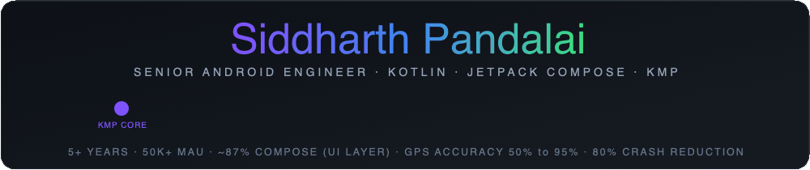
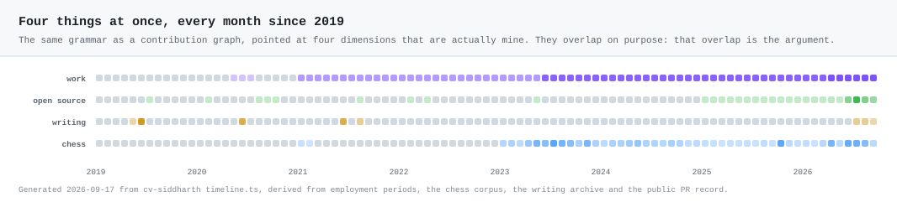
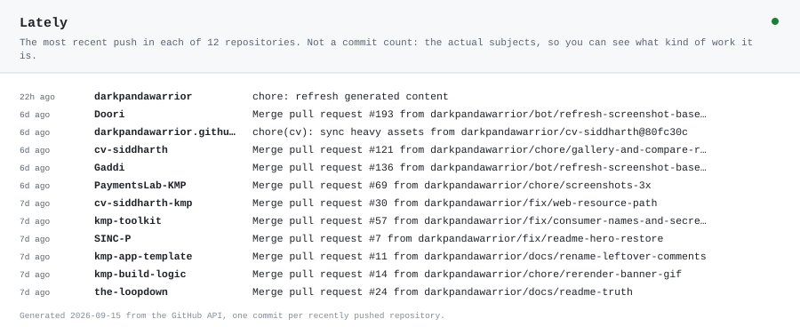
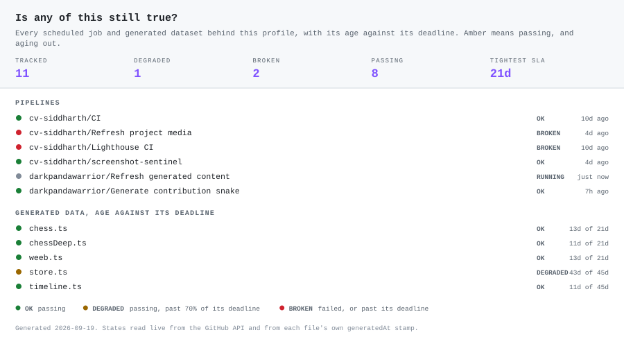
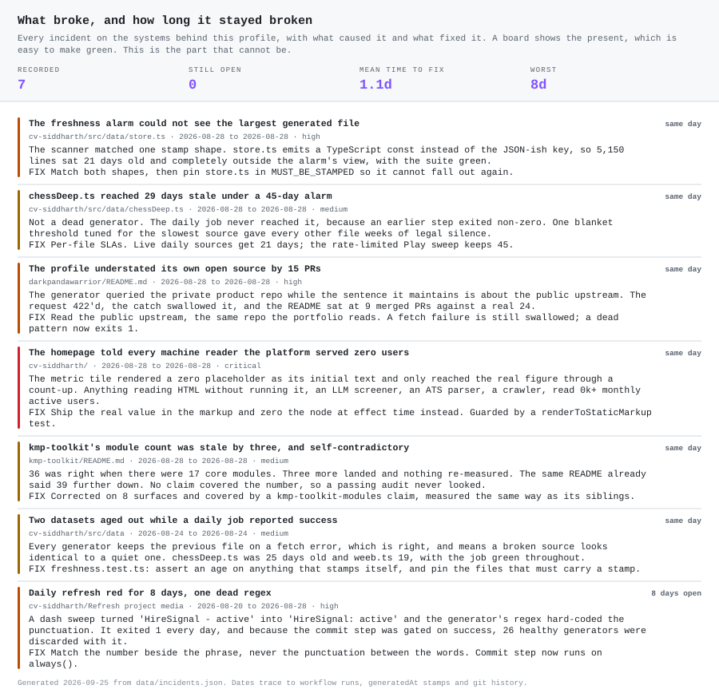
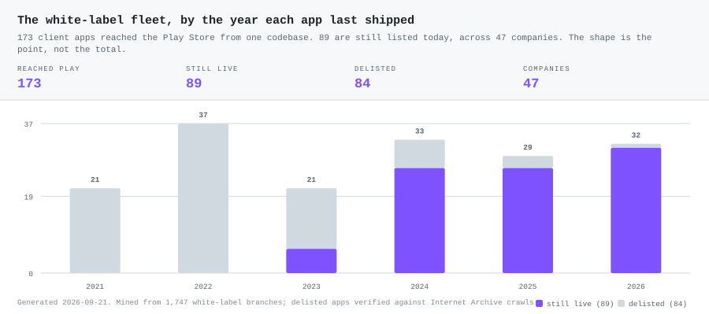
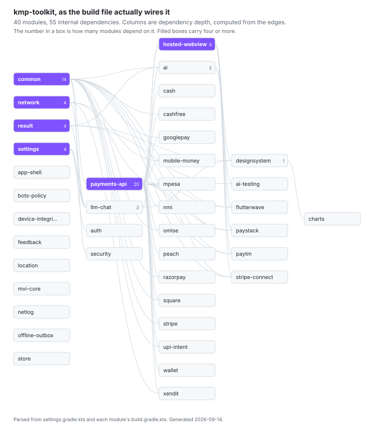
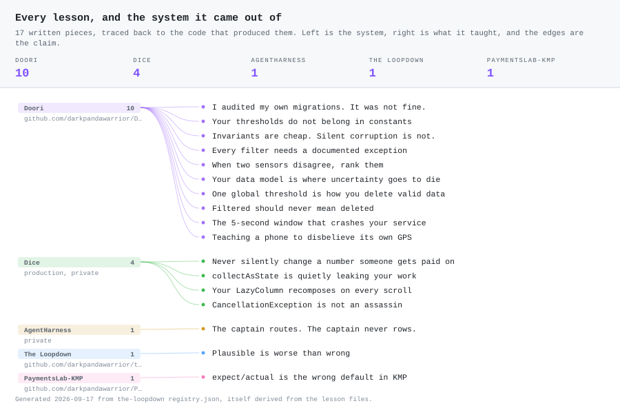

# Siddharth Pandalai

**Senior Android Engineer** at [Dice.tech](https://dice.tech/). I own the Android platform: ~964k lines, 772k of them Kotlin, serving **50,000+ MAU** and **22,000+ DAU**.

[Portfolio](https://cv-siddharth.vercel.app) &nbsp;·&nbsp; [Interactive CV](https://cv-siddharth.vercel.app/resume) &nbsp;·&nbsp; [Hire me](https://cv-siddharth.vercel.app/hire) &nbsp;·&nbsp; [LinkedIn](https://linkedin.com/in/siddharth-pandalai)

**80%** crash reduction &nbsp;·&nbsp; GPS **50% to 95%** &nbsp;·&nbsp; **~87%** of the UI layer on Compose &nbsp;·&nbsp; AES-256 Keystore, SSL pinning across **9 domains**, VAPT cleared

<picture>
  <source media="(prefers-color-scheme: dark)" srcset="assets/lanes-dark.svg" />
  
</picture>

<picture>
  <source media="(prefers-color-scheme: dark)" srcset="assets/now-dark.svg" />
  
</picture>

---

Everything below is drawn by a generator from a real source, and every generator
has a deadline. If one dies, a job opens itself an issue and the badge goes red.
The three panels after this one are that machinery, in public.

<b>Live status board</b> &nbsp;·&nbsp; 11 jobs and datasets tracked, each against its own deadline

 

<picture>
  <source media="(prefers-color-scheme: dark)" srcset="assets/board-dark.svg" />
  
</picture>

This profile has been red three times, and each time the tests stayed green.
That is why the board grades against a deadline rather than a pass or fail, and
why it is published rather than kept in a dashboard only I look at.

<b>Incident ledger</b> &nbsp;·&nbsp; 7 recorded, 0 open, mean time to fix 1.1 days, worst 8

 

<picture>
  <source media="(prefers-color-scheme: dark)" srcset="assets/ledger-dark.svg" />
  
</picture>

Including the eight days a daily job was red because a dash sweep silently
killed a regex, and the day this profile was caught reporting nine
of its own merged pull requests when the real figure was twenty four. Publishing the mean time to fix is the only part of a
status page that costs anything to be honest about.

## The fleet I shipped

<picture>
  <source media="(prefers-color-scheme: dark)" srcset="assets/fleet-dark.svg" />
  
</picture>

At Jugnoo I built the per-tenant flavour system, one build config and one set of
resource overlays, that let a client app ship without forking the codebase. The
interesting number is not the total, it is the shape: apps launched under that
system are still being updated years later. [See the fleet](https://cv-siddharth.vercel.app/shipped),
checked against the Play Store and Internet Archive crawls rather than memory.

## The KMP family

Nothing became a library until a second consumer needed the same logic.

- [**kmp-toolkit**](https://github.com/darkpandawarrior/kmp-toolkit): 39 modules. Typed `Result`, an MVI core, an offline-first store, network, security, on-device AI behind one seam, a 19-provider payment abstraction. MIT.
- [**kmp-build-logic**](https://github.com/darkpandawarrior/kmp-build-logic): 22 authored convention plugins, vendored by `includeBuild` across five repos, so a version bump happens once.
- [**kmp-app-template**](https://github.com/darkpandawarrior/kmp-app-template): the app shape the toolkit slots into, buildable on day one.

<b>Dependency graph</b> &nbsp;·&nbsp; 39 modules, 43 internal edges, layered by computed depth

 

<picture>
  <source media="(prefers-color-scheme: dark)" srcset="assets/modules-dark.svg" />
  
</picture>

Parsed from `settings.gradle.kts` and each module's build file. The columns are
dependency depth computed from the edges, so the layering is a measurement of
the architecture rather than a drawing of it.

<b>Writing provenance</b> &nbsp;·&nbsp; 17 lessons, ten of them out of a single project

 

<picture>
  <source media="(prefers-color-scheme: dark)" srcset="assets/provenance-dark.svg" />
  
</picture>

"Engineer who writes" is a claim anyone can make. The edge is the interesting
part: ten of these came out of Mileway alone. That is not a blog, it is one
project that produced ten things worth writing down.

## What I do

One platform, seen at different layers. Depth is behind the links.

| Lane | The proof | The number |
|---|---|---|
| **Android at scale** | Dice platform: GPS pipeline, Compose migration, crash and concurrency work, security hardening | 50k MAU, 80% fewer crashes |
| **Platform ownership** | Jugnoo's white-label estate and the automation that shipped it | 173 apps on Play, 80% less delivery time |
| **Libraries and build** | [kmp-toolkit](https://github.com/darkpandawarrior/kmp-toolkit), [kmp-build-logic](https://github.com/darkpandawarrior/kmp-build-logic), [kmp-app-template](https://github.com/darkpandawarrior/kmp-app-template) | 39 modules, 22 plugins |
| **Tooling** | The generators that draw this page, and the guards that fail when their data ages | every figure machine-checked |
| **Writing and games** | [The Loopdown](https://github.com/darkpandawarrior/the-loopdown), [Kursi](https://github.com/darkpandawarrior/Kursi) | one war story, four platforms |

<b>Everything else I maintain</b> &nbsp;·&nbsp; eight repositories, one line each

 

| Repo | What it is | Its number |
|---|---|---|
| [Mileway](https://github.com/darkpandawarrior/Mileway) | Mileage and trip tracking, offline-first, Ktor backend | 46 modules, 5 platforms |
| [PaymentsLab](https://github.com/darkpandawarrior/PaymentsLab) | Every payment gateway behind one abstraction, each transaction's lifecycle visible | 40 modules |
| [Kursi](https://github.com/darkpandawarrior/Kursi) | Bluffing card game, ISMCTS and LLM opponents on a byte-for-byte deterministic engine | Android, iOS, Desktop, Web |
| [cv-siddharth](https://github.com/darkpandawarrior/cv-siddharth) | This portfolio: React 19, multi-provider LLM chat, and the generator farm behind every number | 83 test files |
| [cv-siddharth-kmp](https://github.com/darkpandawarrior/cv-siddharth-kmp) | The same portfolio in one Kotlin `commonMain`, rendering to Wasm, Desktop, Android, iOS | near dependency-free |
| **HireSignal** [(case study)](https://cv-siddharth.vercel.app/project/hiresignal) | Local-first AI career-intelligence dashboard: resume onboarding, reverse-ATS discovery (81 providers), evidence-based fit scoring. Built on the open-source [career-ops](https://github.com/santifer/career-ops) engine. Private while v1 lands | case study is public |
| [The Loopdown](https://github.com/darkpandawarrior/the-loopdown) | One war story from a real project, adapted to four platforms, with a linter that strips AI tells | 4 channels |
| [SINC-P](https://github.com/darkpandawarrior/SINC-P) | Statutory student grievance redressal, UGC 2023 compliant, with an SLA clock | compliance-cited |

## Open source

**24 merged PRs** to [career-ops](https://github.com/santifer/career-ops) (⭐68k+): two new ATS providers ([BambooHR](https://github.com/santifer/career-ops/pull/1141), [Breezy HR](https://github.com/santifer/career-ops/pull/1185)), a [dashboard status-cell fix](https://github.com/santifer/career-ops/pull/1186) and an [agent-inbox feature](https://github.com/santifer/career-ops/pull/1472).

Most of the rest are correctness fixes, each with a reproduction and a regression test, and each the same class of bug: code that reports success while doing the wrong thing. Non-Latin company names [collapsing into one and deleting a tracked application](https://github.com/santifer/career-ops/pull/2587). `$`-patterns in CV text [splicing the template into the resume](https://github.com/santifer/career-ops/pull/2588) at exit 0. A date filter [silently ignored in its `--flag=value` form](https://github.com/santifer/career-ops/pull/2589).

**Stack:** Kotlin · Jetpack Compose · Compose Multiplatform · Coroutines and Flow · Koin and Hilt · Room and DataStore · Ktor · WorkManager · Gradle convention plugins
**Architecture:** MVVM and Clean Architecture · MVI unidirectional state · offline-first · multi-module

<picture>
  <source media="(prefers-color-scheme: dark)" srcset="https://raw.githubusercontent.com/darkpandawarrior/darkpandawarrior/output/github-contribution-grid-snake-dark.svg" />
  
</picture>

## Connect

---

Avid reader, chess player, and connoisseur of puns and coffee.

